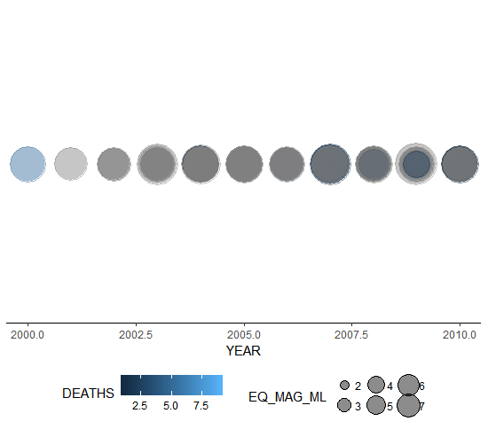
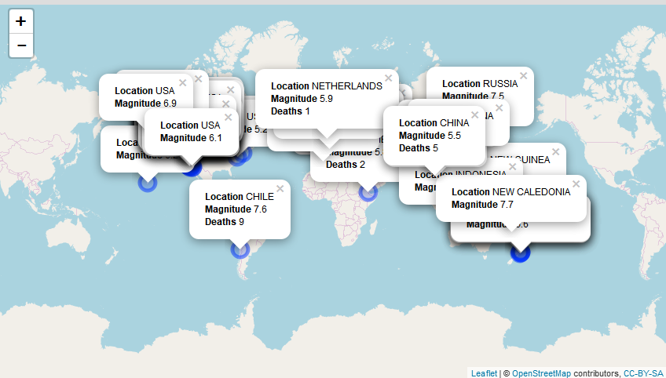

```{r setup, include = FALSE}
knitr::opts_chunk$set(
  collapse = TRUE,
  comment = "#>"
)
```


This package is designed to work with ([NOAA Significant Earthquake Database](https://www.ngdc.noaa.gov/nndc/struts/form?t=101650&s=1&d=1)). Note, that database is not included in the package. To get it, follow the link above and download it (tab delimited format)

After dowloading data store it as `data.frame` object in the way you prefer (for example, using `read_delim` function). Note, that classes of some variables of dataset are not that could be expected: Longitude, Latitude, Deaths, etc. are provided as character, not as numerics.
Use `eq_clean_data()` function, applyed to raw data.frame to return "cleaned" one: with numerics, as well as additional columns: 

- `DATE` columns merging together `YEAR`, `MONTH` & `DAY` to Date class
- `LOCATION_NAME` which is result of cleaning `COUNTRY` column


## Static plots

Use `geom_timeline` to get plot of hurricanes occured. For example, data from 2000 to 2010 could be viewed using the code:


 `cleaned_base%>%filter(YEAR>=2000 & YEAR<=2010 & !is.na(EQ_MAG_ML))%>%ggplot()+
  geom_timeline(aes(fill=DEATHS, colour=DEATHS, x=YEAR, size=EQ_MAG_ML))+theme_timeline`
  
which will result in: 




It is also possible to arrange hurricane dots on y axis, for example, by country:

`cleaned_base%>%filter(YEAR>=2000 & YEAR<=2003 & !is.na(EQ_MAG_ML))%>%ggplot()+
  geom_timeline(aes(fill=DEATHS, colour=DEATHS, x=YEAR, y=COUNTRY, size=EQ_MAG_ML))+theme_timeline`
  
which looks as follows:


The other option to mark countries is to put tick captions, using `geom_timeline_label`:

`cleaned_base%>%filter(YEAR>=2000 & YEAR<=2004 & !is.na(EQ_MAG_ML))%>%ggplot()+
  geom_timeline_label(aes(fill=DEATHS, colour=DEATHS, x=YEAR, y=COUNTRY, caption=COUNTRY, size=EQ_MAG_ML, n_max=2))+
  theme_timeline`
  
here `n_max` stays on how much top n (by size) hurricane dots should have captions (New Zeeland and Chile in our case):


Finally, to make interactive plot using HtmlWidget, you can use `eq_map` function. It allows to point the hurricane dots on the map, making popup-text. Because this is specific package, designed for the final assigment and fitted to the particular dataset, function `eq_create_label` takes base as data.frame object, as well as column names for longitude, latiitude and death numbers to character vector of popup-text for the map. If you need to pull text, containig other information, it could be stored as additional column to data.frame and used in the same way:

`cleaned_base_copy<-cleaned_base%>%filter(YEAR>=2000 & YEAR<=2010 & !is.na(EQ_MAG_ML))%>%
  mutate(popup_text = eq_create_label(.,location="COUNTRY", magnitude="EQ_MAG_ML", death="DEATHS"))` 
  
filter the data and adds column `popup_text` containig described information
  
  
`eq_map(cleaned_base_copy, longitude="LONGITUDE", latitude="LATITUDE", annot_col = "popup_text")`



